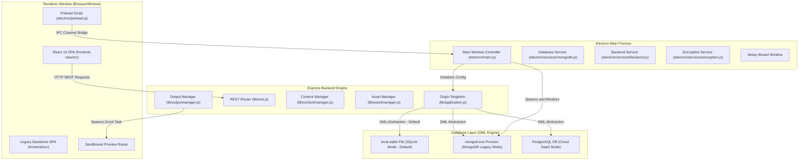
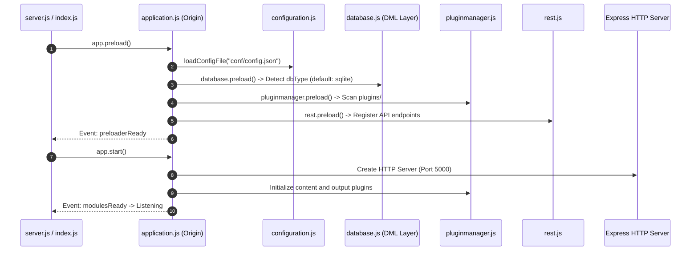
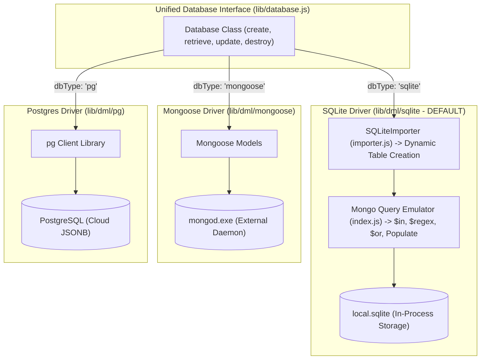
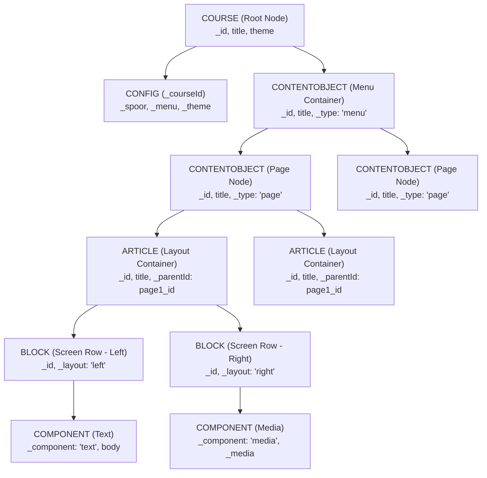
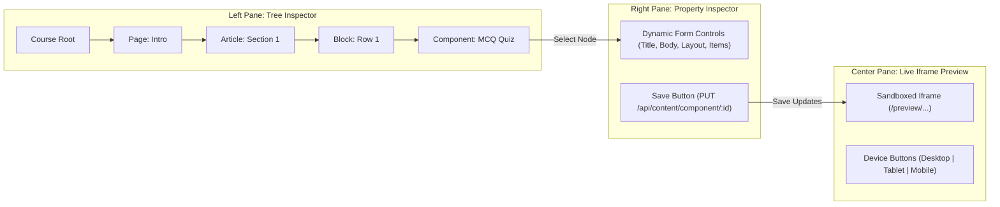
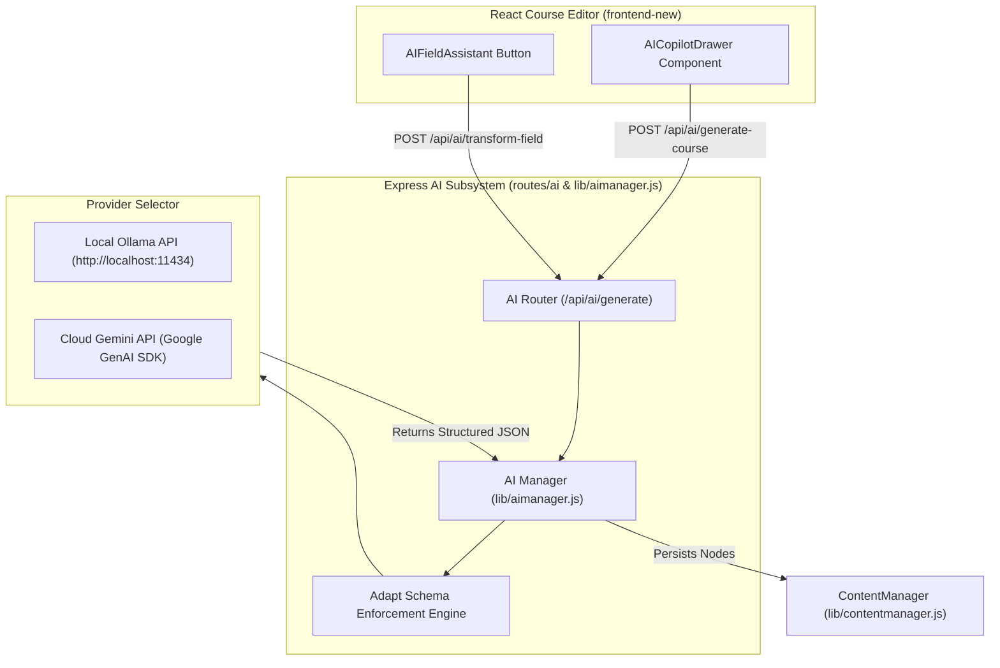
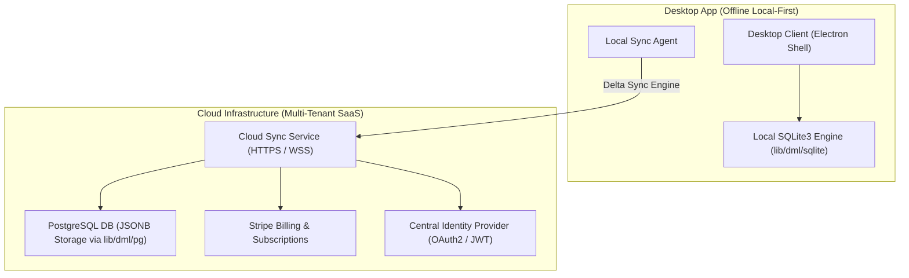

# SINQ Authoring Tool (Adapt Authoring Engine)
## Comprehensive Technical Documentation, Architectural Specification & Native AI Blueprint

---

## Executive Summary & System Overview

The **SINQ Authoring Tool** (version 0.11.5 / 1.0.0 Architecture) is an enterprise-grade, desktop and web e-learning content management system built on top of the **Adapt Framework**. It enables instructional designers, educators, and enterprise teams to construct responsive, multi-device HTML5 e-learning courses without writing manual code.

The system is engineered as a **hybrid application** combining an **Electron desktop shell**, a robust **Node.js/Express backend service**, a **multi-database data modeling abstraction layer (DML)** supporting **SQLite3 (default out-of-the-box engine)**, MongoDB, and PostgreSQL, and a **dual-tier frontend architecture** comprising a legacy Backbone.js/Marionette single-page application and a next-generation React 19 / Vite 8 visual editor interface.

```
+-----------------------------------------------------------------------------------+
|                                 SINQ AUTHORING TOOL                               |
+-----------------------------------------------------------------------------------+
|  ELECTRON DESKTOP SHELL (Main Process, Preload, Window Management, Setup Wizard)  |
+-----------------------------------------------------------------------------------+
|  FRONTEND SPA (React 19 / Vite 8  <--->  Backbone.js / Marionette / Less / HBS)   |
+-----------------------------------------------------------------------------------+
|  EXPRESS BACKEND ENGINE (ContentManager, AssetManager, OutputManager, Auth, REST) |
+-----------------------------------------------------------------------------------+
|  MULTI-DB DATA LAYER (DML: SQLite3 Default | Mongoose ODM | PostgreSQL)          |
+-----------------------------------------------------------------------------------+
|  ADAPT FRAMEWORK BUILD ENGINE (Grunt Task Runner, JSON Schemas, Theme Compiler)   |
+-----------------------------------------------------------------------------------+
|  NATIVE AI ENGINE (Planned Copilot, Document-to-Course, Inline Component Editor)  |
+-----------------------------------------------------------------------------------+
```

### Core System Objectives
1. **Zero-Configuration Desktop Operations**: Provide a single portable executable (`.exe`) for Windows that runs entirely in-process using an embedded SQLite database engine (`local.sqlite`), eliminating external database server dependencies, port conflicts, and background daemon failures.
2. **Dynamic Schema-Driven Architecture**: Define e-learning content structures through JSON Schemas, allowing new components, themes, and extensions to automatically render form interfaces and compile database models without backend code changes.
3. **Dual Frontend Transition**: Maintain backward compatibility with legacy Backbone.js authoring modules while providing a modern, high-performance React 19 visual course builder with live iframe preview and drag-and-drop structural rearrangement.
4. **Native AI Authoring Integration**: Introduce a native AI Content Generator and Copilot capable of turning raw documents/prompts into complete structured courses, auto-generating interactive quizzes/accordions, and re-writing course content inline with strict JSON schema compliance.

---

## 1. System Architecture & Process Topology

The SINQ Authoring Tool utilizes a multi-process architecture to separate desktop lifecycle management, HTTP backend services, database operations, and user interface rendering.

### 1.1 Process Model



### 1.2 Inter-Process Communication (IPC) & Preload Context

The Electron shell isolates renderer logic from node runtime environments using Electron's `contextBridge` and `preload.js`.

- **Preload Interface (`electron/preload.js`)**:
  ```javascript
  const { contextBridge, ipcRenderer } = require('electron');

  contextBridge.exposeInMainWorld('electronAPI', {
    send: (channel, data) => ipcRenderer.send(channel, data),
    on: (channel, func) => ipcRenderer.on(channel, (event, ...args) => func(...args)),
    invoke: (channel, data) => ipcRenderer.invoke(channel, data)
  });
  ```
- **IPC Event Channels**:
  - `setup-complete`: Triggered when the onboarding wizard completes configuration.
  - `restart-app`: Initiates clean backend shutdown and window reload.
  - `get-env-info`: Returns desktop paths, database engine status, and runtime environment settings.

### 1.3 Security Architecture
- **Content Security Policy (CSP)**: Enforces strict script sources, preventing inline code injection while allowing `unsafe-eval` solely for pre-compiled Handlebars templates in legacy views.
- **Session Security (`lib/sessionSecret.js`)**: Automatically generates a cryptographically secure 256-bit session secret key saved to `conf/config.json` upon initial boot to prevent session tampering.
- **Password Encryption (`lib/usermanager.js`)**: Uses `bcryptjs` with salt rounds set to 10 for password storage.

---

## 2. Backend Core Engine & API Deep Dive

The backend core is encapsulated by the `Origin` application singleton located in [lib/application.js](file:///c:/SINQ_authoring_desktop/adapt_authoring-1/lib/application.js).

### 2.1 Backend Boot Sequence (`server.js` -> `index.js` -> `lib/application.js`)



### 2.2 Subsystem Inventory & Operational Roles

| Subsystem Module | Source File | Responsibilities & Functions |
| :--- | :--- | :--- |
| **Origin Engine** | `lib/application.js` | Express app wrapper, global event bus (`EventEmitter`), module loading orchestrator. |
| **Content Manager** | `lib/contentmanager.js` | Handles CRUD operations for Adapt course elements (`course`, `contentobject`, `article`, `block`, `component`). Provides content event hooks (`addContentHook`). |
| **Asset Manager** | `lib/assetmanager.js` | Manages file uploads, image thumbnails, media asset tagging, metadata extraction via `ffprobe`, and mime type checking. |
| **Output Manager** | `lib/outputmanager.js` | Orchestrates Adapt course builds, Grunt process execution, tenant output directory isolation, preview serving, and ZIP archive publishing. |
| **Plugin Manager** | `lib/pluginmanager.js` | Discovers, installs, updates, and manages Adapt plugins (components, extensions, themes, menus) from Bower / NPM. |
| **Database Subsystem** | `lib/database.js` | Connects to database drivers, compiles JSON schemas into runtime database models, and manages transactions. |
| **Permission Manager** | `lib/permissions.js` | Enforces Role-Based Access Control (RBAC), tenant isolation, and resource policy statement validation. |
| **User Manager** | `lib/usermanager.js` | Handles user authentication, password resets, profile management, and session association. |
| **Tenant Manager** | `lib/tenantmanager.js` | Supports multi-tenancy bounds, mapping courses and assets to isolated tenant IDs (`_tenantId`). |
| **File Storage** | `lib/filestorage.js` | Storage abstraction for saving media uploads to local filesystem storage or cloud buckets. |
| **Mailer Subsystem** | `lib/mailer.js` | Configures SMTP transport via Nodemailer to send verification emails and password reset tokens. |

### 2.3 Comprehensive REST API Router Specification

The backend exposes RESTful API endpoints managed by [lib/rest.js](file:///c:/SINQ_authoring_desktop/adapt_authoring-1/lib/rest.js) and individual route handlers located under `routes/`.

```
========================================================================================
METHOD    ENDPOINT                         CONTROLLER / HANDLER             PURPOSE
========================================================================================
GET       /api/content/:type               contentmanager.retrieve          Fetch items of type (course, page, article, etc.)
POST      /api/content/:type               contentmanager.create            Create new course element with schema validation
PUT       /api/content/:type/:id           contentmanager.update            Update existing element attributes
DELETE    /api/content/:type/:id           contentmanager.destroy           Remove element and cascade delete children
----------------------------------------------------------------------------------------
GET       /api/asset                       assetmanager.retrieve            Fetch media asset library items
POST      /api/asset                       assetmanager.create              Upload media asset (Multer multi-part form)
PUT       /api/asset/:id                   assetmanager.update              Update asset tags or title
DELETE    /api/asset/:id                   assetmanager.destroy             Delete asset file and database record
----------------------------------------------------------------------------------------
POST      /api/output/preview/:id          outputmanager.preview            Trigger Grunt build for course preview
GET       /preview/:tenant/:course/*       routes/preview/index.js          Serve pre-compiled course preview files
POST      /api/output/publish/:id          outputmanager.publish            Build course and return downloadable ZIP stream
----------------------------------------------------------------------------------------
POST      /api/auth/login                  auth.login                       Authenticate user credentials & establish session
POST      /api/auth/logout                 auth.logout                      Destroy current express session
GET       /api/user/me                     usermanager.getCurrentUser       Retrieve logged-in user profile
POST      /api/user                        usermanager.create               Register new user account
----------------------------------------------------------------------------------------
GET       /api/schema                      database.getSchemas              Return all registered JSON schemas
GET       /api/plugin                      pluginmanager.getPlugins         List installed Adapt components/extensions
========================================================================================
```

---

## 3. Custom Multi-Database Layer (DML) & SQLite Design Rationale

A core architectural breakthrough in the SINQ Authoring Tool is the creation of the **Data Manipulation Layer (DML)** located in [lib/dml/](file:///c:/SINQ_authoring_desktop/adapt_authoring-1/lib/dml/). 

While the original legacy Adapt Authoring Tool was strictly tied to a MongoDB database daemon, SINQ introduces a multi-database abstraction layer. In [lib/database.js](file:///c:/SINQ_authoring_desktop/adapt_authoring-1/lib/database.js#L612), the default out-of-the-box database type is explicitly set to `sqlite`.

### 3.1 Design Rationale & Strategic Reasons for the Custom SQLite Build

The custom SQLite DML driver ([lib/dml/sqlite/index.js](file:///c:/SINQ_authoring_desktop/adapt_authoring-1/lib/dml/sqlite/index.js) and [lib/dml/sqlite/importer.js](file:///c:/SINQ_authoring_desktop/adapt_authoring-1/lib/dml/sqlite/importer.js)) was architected for five key operational reasons:

1. **Zero-Configuration Desktop Operations**:
   - Spawning an external `mongod.exe` background process inside an Electron portable desktop app creates major user friction. It causes port conflicts (e.g. port 27017 in use), permission/lock file errors in `%APPDATA%`, antivirus process blocking, and requires bundling heavy 100MB+ MongoDB binaries inside desktop installers.
   - SQLite runs **entirely in-process** inside Node.js using `sqlite3`, storing all application data inside a single portable file (`local.sqlite`). This makes the application 100% self-contained and zero-configuration.

2. **Transparent Document Query & Mongoose API Emulation Layer**:
   - Instead of refactoring thousands of lines of legacy business logic across `ContentManager`, `UserManager`, `AssetManager`, `TenantManager`, and 14+ Adapt content plugins, the SQLite driver implements a complete Mongo/Mongoose query emulation engine.
   - `lib/dml/sqlite/index.js` provides native support for:
     - Complex Mongo query operators: `$in`, `$ne`, `$regex`, `$gt`, `$lt`, `$gte`, `$lte`, `$or`, `$and`.
     - Dot-notation path matching (`getValueByPath` for nested sub-document queries).
     - Field projection (`projectDoc`) and relational populator mechanics (`buildPopulator`).
     - Hexadecimal 24-character MongoDB-compatible ObjectId generation (`generateObjectId()`).

3. **Dynamic JSON Schema-to-Relational Table Translation**:
   - [lib/dml/sqlite/importer.js](file:///c:/SINQ_authoring_desktop/adapt_authoring-1/lib/dml/sqlite/importer.js) reads Adapt JSON schemas (`model.schema`) and automatically creates SQLite relational tables on the fly.
   - Primitive attributes (strings, numbers, booleans) map to standard SQL column types (`TEXT`, `INTEGER`, `REAL`).
   - Complex nested objects and arrays (e.g. `_items`, `_spoor`, `themeSettings`) are serialized as `TEXT` JSON fields.
   - Indexes are automatically generated for high-frequency lookup keys (`_id`, `_courseId`, `_parentId`, `_tenantId`, `email`).

4. **Instant Application Startup & Low Memory Footprint**:
   - Embedded SQLite opens instantly on app launch without waiting for database socket handshakes or lockfile cleanups.
   - Reduces RAM usage by over 200MB compared to running a standalone MongoDB daemon process alongside Electron.

5. **Bridge to Cloud SaaS & Multi-Tenant Architecture**:
   - Transitioning from MongoDB to SQL establishes a unified relational baseline across local and cloud environments.
   - The DML engine supports SQLite for offline local desktop users and PostgreSQL (`lib/dml/pg/`) for cloud SaaS hosting, keeping the database data access API identical across environments.



---

### 3.2 Adapt Course Hierarchy Structure

An eLearning course is stored as an asymmetrical hierarchical tree across six primary database collections:



---

## 4. Frontend Dual-Tier Architecture

The application contains two frontend user interfaces reflecting its architectural evolution.

### 4.1 Tier 1: Legacy Backbone.js / Marionette SPA (`frontend/src/`)
- **Technology Stack**: Backbone.js, RequireJS (AMD loader), Handlebars templates, LESS stylesheets, Velocity.js animations.
- **Key Modules**:
  - `modules/editor/`: Course structure editor, tree navigation, and property panel.
  - `modules/assetManagement/`: Media gallery, upload modal, tag filtering.
  - `modules/sidebar/`: Collapsible contextual options and action triggers.

### 4.2 Tier 2: Modern React 19 + Vite 8 SPA (`frontend-new/src/`)
- **Technology Stack**: React 19, Vite 8, Lucide React icons, Axios, CSS Variables design system.
- **Architecture & View Hierarchy**:
  ```
  App.jsx (Session Router & View Switcher)
    └── AppShell.jsx (Header, Sidebar Navigation, User Dropdown)
          ├── Dashboard.jsx (Project Cards, Course Search, Create Course Modal)
          ├── CourseEditor.jsx (3-Pane Visual Builder, Tree Inspector, Form Editor, Preview)
          └── AdminPortal.jsx (User Management, Plugin Manager, Tenant Settings)
  ```

#### Highlights of `CourseEditor.jsx`:
- **3-Pane Resizable Interface**: Features drag-to-resize splitters (`leftSidebarWidth`, `rightSidebarWidth`) allowing custom workbench widths.
- **Tree Inspector**: Displays expandable nodes for Pages, Articles, Blocks, and Components with quick-add actions (`addPage`, `addArticle`, `addBlock`, `addComponent`).
- **Form Inspector**: Dynamically generates form inputs based on the selected element's `model.schema`.
- **Live Preview Panel**: Embeds a sandboxed `<iframe>` pointing to `/preview/:tenantId/:courseId/index.html` with responsive device toggles (Desktop, Tablet, Mobile).



---

## 5. Electron Desktop Shell & Packaging System

The desktop package wraps the backend and local database inside an Electron 24 environment configured for portable deployment.

### 5.1 Main Process Execution (`electron/main.js`)
1. **Pre-flight Checks**: Validates paths, environment variables, and availability of required directories.
2. **Database Process Spawning (`electron/services/mongodb.js`)**:
   - In SQLite mode (default), boots directly with zero child process dependencies.
   - In legacy MongoDB mode, locates `resources/mongodb/bin/mongod.exe` or `.mongo-data`, cleans up `.lock` files, and manages background execution on port 27017.
3. **Backend Service Launch (`electron/services/backend.js`)**:
   - Requires `lib/application.js`, configures runtime settings, and starts the Express server on port `5000`.
4. **BrowserWindow Initialization**:
   - Creates the main desktop window (`width: 1400`, `height: 900`).
   - Loads `http://localhost:5000` (or `http://localhost:5173` in development mode).

### 5.2 Build & Packaging Pipeline
- **Bundling Engine**: Uses `electron-builder` with NSIS portable target configuration (`package.json`).
- **Packaging Verification Script (`scripts/verify-packaged-modules.js`)**: Runs automatically post-build to verify that all nested runtime dependencies (`bower-logger`, `configstore`, `mout`, `q`, `bower-config`) exist inside `dist/win-unpacked/resources/app/node_modules/`.

---

## 6. Native AI Integration Architecture (Detailed Future Blueprint)

To transform the SINQ Authoring Tool into an industry-leading intelligent authoring platform, we specify the implementation of a **Native AI Assistant & Content Copilot**.

### 6.1 Vision & Core AI Capabilities

```
+-----------------------------------------------------------------------------------+
|                             NATIVE AI ENGINE ARCHITECTURE                         |
+-----------------------------------------------------------------------------------+
|  1. PROMPT / DOC-TO-COURSE  | Generates full course structure from raw text/PDF   |
|  2. INLINE FIELD ASSISTANT  | Rephrases, translates, expands, or summarizes text  |
|  3. INTERACTIVE QUIZ GEN    | Creates MCQs, Matching & Drag-and-Drop questions    |
|  4. STRUCTURAL AUTO-LAYOUT  | Converts heavy text blocks into accordions & tabs   |
|  5. AI VISUAL GENERATOR     | Produces contextual illustrations & diagrams        |
+-----------------------------------------------------------------------------------+
```

### 6.2 Dual AI Provider Architecture (Local Privacy + Cloud Power)

The AI engine will support a hybrid configuration selectable in user settings:
1. **Local AI Engine (Offline Privacy Mode)**: Connects to a locally running **Ollama** or **LM Studio** instance via HTTP REST (`http://localhost:11434`), allowing complete offline AI generation using models such as `Llama 3.2`, `Mistral-7B`, or `Phi-3`.
2. **Cloud AI Engine (High Performance Mode)**: Connects directly to Google Gemini API (`gemini-1.5-pro` / `gemini-2.0-flash`) or OpenAI API (`gpt-4o`) using user-provided API keys.



### 6.3 Technical Specification for Backend AI Engine

#### File: `lib/aimanager.js` (NEW)
```javascript
const axios = require('axios');
const configuration = require('./configuration');
const contentmanager = require('./contentmanager');
const logger = require('./logger');

class AIManager {
  constructor() {
    this.provider = configuration.getConfig('aiProvider') || 'gemini'; // 'gemini' | 'ollama' | 'openai'
    this.apiKey = configuration.getConfig('aiApiKey') || '';
    this.localUrl = configuration.getConfig('aiLocalUrl') || 'http://localhost:11434';
  }

  /**
   * Transforms raw text or document outline into a complete Adapt Course JSON tree
   */
  async generateCourseFromPrompt({ prompt, courseTitle, targetAudience, numPages = 3 }) {
    const systemPrompt = `
      You are an expert instructional designer. Generate a structured eLearning course for Adapt Framework.
      Strictly return a JSON object adhering to this schema:
      {
        "title": "${courseTitle}",
        "pages": [
          {
            "title": "Page Title",
            "articles": [
              {
                "title": "Article Title",
                "blocks": [
                  {
                    "title": "Block Title",
                    "components": [
                      {
                        "_component": "text",
                        "_layout": "full",
                        "title": "Component Title",
                        "body": "<p>HTML body text</p>"
                      },
                      {
                        "_component": "mcq",
                        "_layout": "full",
                        "title": "Knowledge Check",
                        "body": "<p>Question text?</p>",
                        "_items": [
                          { "text": "Option A", "_shouldBeSelected": true, "feedback": "Correct!" },
                          { "text": "Option B", "_shouldBeSelected": false, "feedback": "Incorrect." }
                        ]
                      }
                    ]
                  }
                ]
              }
            ]
          }
        ]
      }
    `;

    const aiResponse = await this._callLLM(systemPrompt, prompt);
    const courseData = JSON.parse(aiResponse);
    return courseData;
  }

  /**
   * Internal wrapper for unified LLM provider calls
   */
  async _callLLM(systemPrompt, userPrompt) {
    if (this.provider === 'gemini') {
      const url = `https://generativelanguage.googleapis.com/v1beta/models/gemini-1.5-flash:generateContent?key=${this.apiKey}`;
      const response = await axios.post(url, {
        contents: [
          { role: 'user', parts: [{ text: `${systemPrompt}\n\nUser Input: ${userPrompt}` }] }
        ],
        generationConfig: { responseMimeType: "application/json" }
      });
      return response.data.candidates[0].content.parts[0].text;
    } else if (this.provider === 'ollama') {
      const url = `${this.localUrl}/api/generate`;
      const response = await axios.post(url, {
        model: 'llama3.2',
        prompt: `${systemPrompt}\n\nUser Input: ${userPrompt}`,
        format: 'json',
        stream: false
      });
      return response.data.response;
    }
  }
}

module.exports = new AIManager();
```

#### File: `routes/ai/index.js` (NEW API Endpoints)
- `POST /api/ai/generate-course`: Accepts prompt/document text and constructs `course`, `contentobject`, `article`, `block`, and `component` records in MongoDB/SQLite.
- `POST /api/ai/transform-field`: Accepts field text and prompt command (`rephrase`, `simplify`, `translate_es`, `make_formal`) and returns modified text string.
- `POST /api/ai/generate-quiz`: Generates MCQ quiz questions from an article body text.

### 6.4 Frontend AI Interface Specification

#### Component: `frontend-new/src/components/AICopilotDrawer.jsx`
A slide-out AI workspace drawer in `CourseEditor.jsx`:
- **Document Uploader**: Drop PDF or DOCX files to automatically convert source material into an interactive eLearning course structure.
- **Course Prompt Wizard**: Input course topic, target audience, tone, and desired interactive components.
- **Live Generation Progress**: Displays progress indicators while nodes are generated and inserted into the course tree.

#### Component: `frontend-new/src/components/AIInlineAssistant.jsx`
A small floating action button attached to text inputs, textareas, and rich-text editors in the Inspector panel:
- Provides quick actions: `✨ Rephrase`, `✨ Summarize`, `✨ Expand`, `✨ Generate Quiz from Text`, `✨ Translate`.

---

## 7. Commercialization & Hybrid Cloud Roadmap

To transition the SINQ Authoring Tool into a high-growth SaaS and desktop commercial solution:



### 7.1 Key Commercial Features
1. **Hybrid Database Engine**: Standardize on SQLite3 for zero-install offline desktop usage and PostgreSQL (`JSONB`) for high-concurrency cloud team access.
2. **Real-Time Visual State Sync**: Replace full Grunt compilation delays during editing by emitting dynamic DOM/CSS updates directly into the preview iframe via `postMessage` or WebSockets.
3. **Team Collaboration & Presence Locking**: Use WebSockets (`socket.io`) to show active users editing specific course nodes, preventing editing collisions.
4. **Subscription Management**: Integrate Stripe for automated tier management (Free Offline Desktop vs. Pro Team Cloud Collaboration).

---

## 8. Comprehensive File & Directory Reference Guide

An exhaustive index of the project structure for reference:

```
adapt_authoring-1/
├── backend/                       # Native backend binaries and helpers
├── conf/                          # System configuration files
│   ├── config.json                # Main application settings (Port, DB URI, Master Tenant)
│   └── migrations.js              # Database migration tool configuration
├── config/                        # Environment config overrides
├── dist/                          # Output directory for packaged desktop installers
├── dist-build/                    # Production assets build directory
├── electron/                      # Electron desktop shell wrapper
│   ├── main.js                    # Main process entry point (spawns mongod & express)
│   ├── preload.js                 # Context isolation bridge for renderer process
│   ├── services/                  # Background desktop services
│   │   ├── backend.js             # Starts Express server process
│   │   ├── encryption.js          # Handles system credential encryption
│   │   ├── installation.js        # Manages Adapt framework downloads & seeding
│   │   ├── migrations.js          # Runs schema migrations on desktop boot
│   │   ├── mongodb.js             # Spawns, monitors, and terminates mongod.exe
│   │   ├── setup.js               # Validates local environment readiness
│   │   └── smtp.js                # Tests desktop email delivery settings
│   └── wizard/                    # Setup wizard frontend pages
├── frontend/                      # Legacy Backbone.js / Marionette frontend application
│   └── src/
│       ├── core/                  # Backbone core engine (app.js, origin.js, router.js)
│       └── modules/               # Feature AMD modules (editor, assetManagement, etc.)
├── frontend-new/                  # Modern React 19 + Vite 8 frontend SPA
│   ├── src/
│   │   ├── App.jsx                # Session router & view switcher
│   │   ├── components/
│   │   │   └── AppShell.jsx       # Layout shell (Header, Sidebar, Navigation)
│   │   ├── utils/
│   │   │   └── api.js             # Axios API client wrapper
│   │   └── views/
│   │       ├── AdminPortal.jsx    # Administration, user management, plugin list
│   │       ├── CourseEditor.jsx   # 3-Pane visual course builder & live preview
│   │       ├── Dashboard.jsx      # Course management dashboard & search
│   │       └── Login.jsx          # User authentication view
│   ├── package.json               # React 19 dependencies & scripts
│   └── vite.config.js             # Vite build configuration
├── lib/                           # Backend Node.js core libraries
│   ├── application.js             # Express app wrapper (Origin class)
│   ├── assetmanager.js            # Media asset management, tagging, ffprobe
│   ├── auth.js                    # Authentication strategies (Passport)
│   ├── bowermanager.js            # Bower dependency manager for Adapt plugins
│   ├── configuration.js           # Central configuration state manager
│   ├── contentmanager.js          # Core CRUD engine for course content items
│   ├── database.js                # Mongoose connection & schema compiler
│   ├── dml/                       # Data Manipulation Layer (Multi-DB abstraction)
│   │   ├── mongoose/              # MongoDB Mongoose ODM driver
│   │   ├── pg/                    # PostgreSQL JSONB driver
│   │   ├── schema/                # System JSON Schemas (user, course, asset, tenant)
│   │   └── sqlite/                # SQLite3 embedded database driver
│   ├── filestorage.js             # File system storage abstraction
│   ├── installHelpers.js          # Framework installation utilities
│   ├── logger.js                  # Winston logging wrapper
│   ├── mailer.js                  # Nodemailer email transport
│   ├── outputmanager.js           # Adapt Grunt build controller & publisher
│   ├── permissions.js             # RBAC policy enforcement
│   ├── pluginmanager.js           # Adapt plugin manager
│   ├── rest.js                    # REST API route setup
│   ├── rolemanager.js             # System roles & permissions manager
│   ├── tenantmanager.js           # Multi-tenant scoping manager
│   └── usermanager.js             # User account administration
├── migrations/                    # Database migration scripts
├── plugins/                       # Installed Adapt server plugins
│   ├── auth/                      # Authentication plugins (local, saml)
│   ├── content/                   # Content type definitions (course, page, article, etc.)
│   ├── filestorage/               # Storage plugins (local, s3)
│   └── output/                    # Output formatters (adapt, scorm)
├── routes/                        # Express API route modules
│   ├── config/                    # Configuration endpoints
│   ├── download/                  # Download endpoints
│   ├── export/                    # Course export endpoints
│   ├── import/                    # Course import endpoints
│   ├── preview/                   # Preview static file server
│   └── ...                        # Other specialized routes
├── scripts/                       # Build and packaging validation scripts
│   └── verify-packaged-modules.js # Verifies electron-builder output integrity
├── Gruntfile.js                   # Grunt build script for legacy frontend and course compilation
├── index.js                       # Root server entry point
├── install.js                     # CLI installer script
├── package.json                   # Main project manifest & dependencies
└── server.js                      # HTTP server boot script
```

---

## 9. Verification & Future Maintenance Protocol

To maintain codebase integrity during future updates and Native AI integration:

1. **Build Verification**:
   ```bash
   npm run build:frontend     # Compiles React 19 frontend via Vite
   npm test                   # Runs Mocha test suite
   npm run verify:packaged    # Validates packaged runtime dependencies
   ```
2. **Node Version Compliance**: Maintain runtime compatibility with Node.js 18.x and NPM 9.x to ensure native C++ modules (`sqlite3`, `bcryptjs`) compile cleanly across Windows operating systems.
3. **Schema Integrity**: Always ensure newly added AI-generated component properties are registered in `model.schema` files to preserve automated database model compilation and form rendering.

---
*Documentation Compiled & Verified for SINQ Authoring Tool Platform Architecture.*
