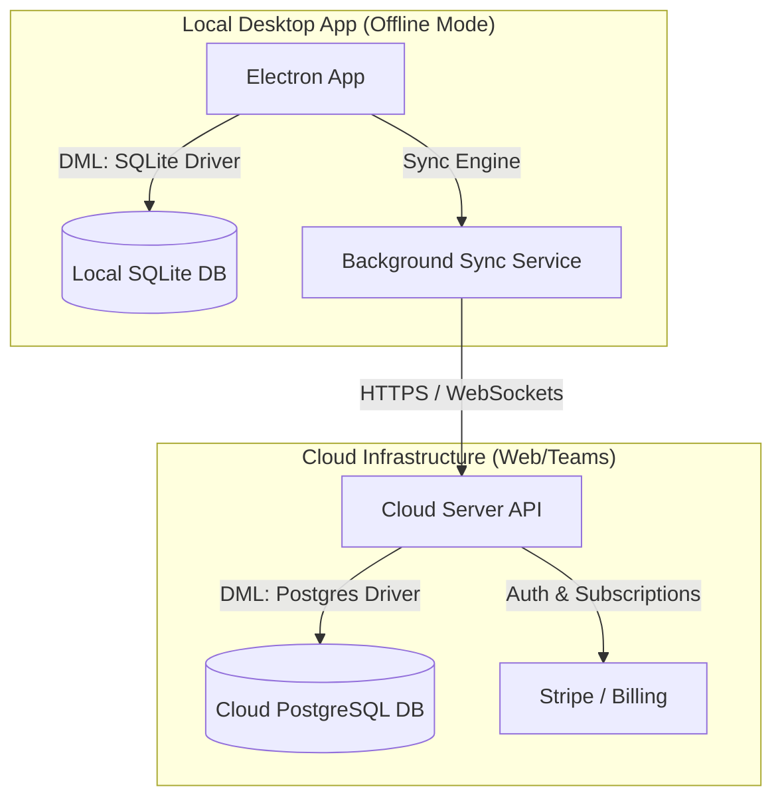

# Commercial Product Architecture: Desktop & Cloud Hybrid

To transform the SINQ Authoring Tool into a commercial product serving single offline users, teams, and large organizations, we need a **hybrid local-first and cloud-connected architecture** utilizing SQL databases.

---

## 1. Hybrid SQL Database Strategy (SQLite3 + PostgreSQL)

We will standardize on SQL databases for both local and cloud environments, replacing MongoDB entirely. This aligns the data storage paradigm across both systems and makes cloud hosting extremely affordable.



- **Local Desktop App**: Runs offline using **SQLite3**. The application requires no local server setup, runs entirely in-process, and has a tiny disk and RAM footprint.
- **Cloud Backend (SaaS)**: Host the server app on a cloud provider utilizing the **PostgreSQL** driver. Postgres is universally supported and cheap to host.
- **JSON Compatibility**: Both databases store dynamic JSON schemas (SQLite as `TEXT`, PostgreSQL as `JSONB`). This allows the same DML methods (`create`, `retrieve`, `update`, `destroy`) to execute identically in both environments.
- **Syncing Engine**: Since both databases are SQL-based, a lightweight background syncing utility can reconcile local SQLite changes with the cloud PostgreSQL database when online.

---

## 2. Real-Time Visual Preview Mechanism

Currently, the Adapt framework requires compiling course assets, which creates a delay. To achieve a **real-time visual builder**:

```
[Visual Editor Form] 
       │ 
       ▼ (State Change)
[Electron Backend / IPC] ──(WebSockets / postMessage)──► [Preview Iframe]
                                                               │
                                                               ▼
                                                      (Dynamic DOM Render)
```

1. **State-Driven Rendering**: In the preview panel, load the course inside an `<iframe>`. Attach a communication script (using `postMessage` or WebSockets) inside the iframe.
2. **Dynamic DOM Adjustments**: When a builder adjusts a UI element (e.g. padding, color, text) in the editor panel, emit the change in real-time. Instead of a full rebuild, the listener inside the iframe intercepts the message and updates the component's DOM elements or CSS variables directly in-place.
3. **Draft States**: Save changes to a draft state in the database while the user is actively adjusting, and finalize/build the package only when they click "Publish".

---

## 3. Commercial Portal & Collaboration Features

To support monetization, team subscription models, and administration:

### Landing Page & Admin Console
- **Public Landing Page**: A marketing site explaining the product, showing features, and listing pricing plans.
- **Central Admin Portal (SaaS)**: A web portal hosted on the cloud where you can manage subscribers, enable/disable team accounts, and monitor usage limits (e.g. storage used, courses built).
- **Payment Integration**: Use **Stripe** to handle subscriptions (monthly/annual) and billing cycles for both individuals and organizations.

### Team Collaboration (Cloud Engine)
- **Role-Based Access Control (RBAC)**: Already supported in the backend manager (`lib/rolemanager.js`), allowing you to assign roles like Admin, Editor, and Reviewer.
- **Real-Time Presence**: Use WebSockets (`socket.io`) to show when other team members are editing the same page or course, preventing editing conflicts (locking nodes when a user has them open).

---

## 4. Execution Roadmap

### Phase 1: Local Foundation (Offline SQLite)
- Implement the SQLite3 DML driver.
- Validate that the Electron app boots instantly with SQLite and zero MongoDB background services.

### Phase 2: PostgreSQL Cloud Driver
- Implement the PostgreSQL DML driver utilizing the native Node `pg` package.
- Verify cloud-ready tables and expression indexes are auto-created in Postgres.

### Phase 3: Visual Preview Engine
- Implement an iframe-based preview panel in the frontend.
- Establish a WebSocket/postMessage sync bridge between editor forms and the preview iframe.
- Enable direct CSS variable manipulation from the editor for real-time design adjustments (padding, fonts, colors).

### Phase 4: Cloud SaaS & Billing Portal
- Build the cloud API using your existing backend codebase configured with the PostgreSQL driver.
- Develop a centralized Landing Page and Billing Console (using Stripe) for managing subscription plans.
- Implement user authentication syncing between desktop local clients and the Cloud subscription server.
