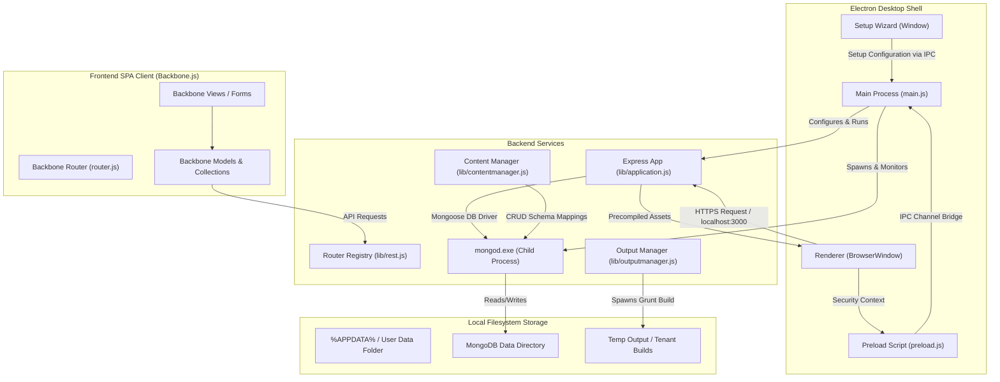
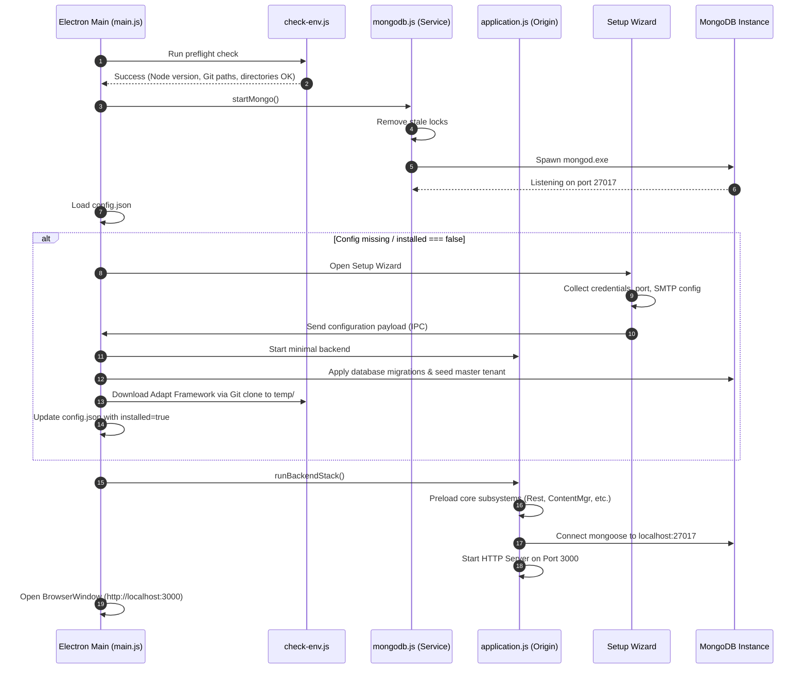
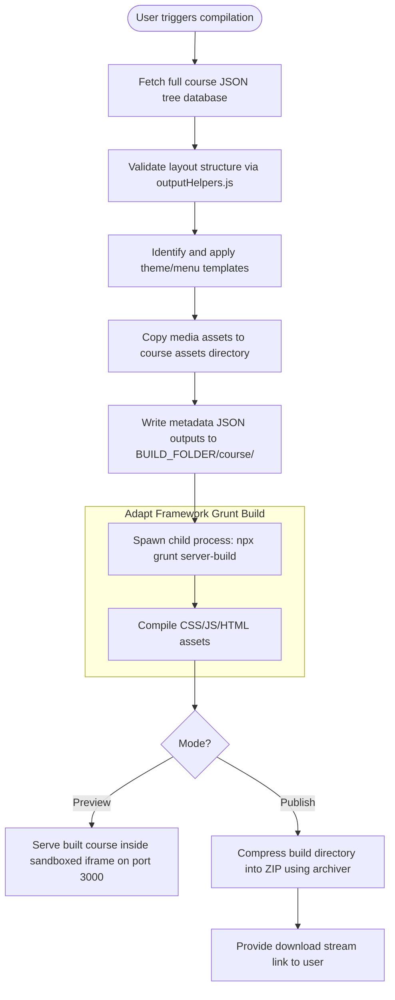

# SINQ Authoring Tool — Architectural & Technical Deep Dive

The SINQ Authoring Tool is a local desktop application packaged as a portable Windows executable. It wraps the **Adapt Authoring Engine** (Node.js, Express) and a local database instance (**MongoDB**) inside an **Electron** wrapper, providing a zero-configuration, secure, and user-friendly desktop experience for creating eLearning courses using the Adapt Framework.

---

## 1. High-Level Architecture

The project is structured as a dual-process system (Electron Main process + local child server processes) communicating over HTTP and IPC (Inter-Process Communication).



### 1.1 Process Model & Roles
1. **Electron Main Process (`electron/main.js`)**:
   - Acts as the main application coordinator and lifecycle manager.
   - Performs environment pre-flight diagnostics (validating Git, Node, paths).
   - Resolves paths dynamically for dev mode vs. packaged production state.
   - Spawns, monitors, and stops the local MongoDB instance.
   - Boots up the Node/Express backend application.
   - Configures window attributes, enforces Content Security Policies (CSP), and handles IPC interfaces.
2. **Express Backend Application (`lib/application.js`)**:
   - A singleton wrapper (`Origin` class inheriting from `EventEmitter`) managing the HTTP server.
   - Dynamically registers all middleware, route folders, and content plugins.
   - Orchestrates core subsystems: content management, file storage, asset organization, user management, and compilation.
3. **Local MongoDB Database**:
   - Spawns as a background child process of the main process on the standard port `27017`.
   - Data is stored locally within the user's AppData directory, meaning no global installations are required.
4. **Backbone.js Single Page Application (SPA)**:
   - Run inside the Electron Renderer window.
   - Uses RequireJS (AMD loader) for client dependency management, Backbone.js for MVC structuring, and Handlebars for pre-compiled DOM templating.

---

## 2. Core Subsystems & Schema Management

### 2.1 The Dynamic Schema System
Unlike traditional hard-coded Mongoose schemas, SINQ uses a metadata-driven dynamic schema setup.
- **Location**: Each content plugin (e.g., [plugins/content/course](file:///c:/SINQ_authoring_desktop/adapt_authoring-1/plugins/content/course/)) includes a `model.schema` JSON file.
- **Structure**: Uses the standard JSON Schema (Draft-04) extended with custom editor attributes:
  - `inputType` (e.g., `Text`, `TextArea`, `Checkbox`, `DisplayTitle`, `Asset`): Dictates which form input control represents this field in the authoring tool UI.
  - `translatable`: Flags that this field requires support in localized translation configurations.
  - `editorOnly`: Signals that the property is solely for layout metadata and must not be packaged inside the compiled framework outputs.
- **Mapping**: `lib/database.js` reads these files and calls its Mongoose driver driver `lib/dml/mongoose/index.js` to compile Mongoose models on the fly during the bootstrap phase.

### 2.2 Adapt Course Hierarchy Collections
The tool represents an eLearning course as a hierarchical tree stored across six primary collections:
1. `course`: The root node representing the entire eLearning project.
2. `config`: Global configuration values (such as defaults for menus, themes, navigation rules, and screen reader configurations).
3. `contentobject`: Represents structural containers. These map directly to:
   - **Menus**: High-level structural categories containing sub-menus or pages.
   - **Pages**: Content layouts containing articles.
4. `article`: Structural layouts belonging to pages. They host one or more columns or blocks.
5. `block`: Layout rows inside articles. They split the screen space (e.g., left, right, or full) and act as placeholders for components.
6. `component`: The final leaf nodes. These are interactive elements (such as text, media, MCQs, accordions, and slider blocks) placed within blocks.

```
[Course Root]
    └── [Config]
    └── [ContentObject - Menu]
             └── [ContentObject - Page]
                      └── [Article]
                               └── [Block] (Left Column)  ── [Component - Text]
                               └── [Block] (Right Column) ── [Component - Media]
```

### 2.3 Subsystem Pipeline & CRUD Hooks
Backend subsystems (managed by `lib/contentmanager.js`) inherit from the base `ContentPlugin` class. This class abstracts common database transactions, handles multi-tenancy bounds, validates user permissions, and provides **Content Hooks** (`addContentHook`).

Key application hooks include:
- **Pre-Update Hook on Course (Theme/Style changes)**: Detects changes to `themeSettings` or `customStyle` and fires a `rebuildCourse` event to invalidate pre-compiled cache outputs.
- **Pre-Create/Pre-Destroy Hooks on Components**: Detects when a component type is added or removed from a course for the first time. If the component's presence list changes, a framework rebuild is flagged.
- **Post-Update Hooks on Layouts**: Automatically updates the `updatedAt` and `updatedBy` timestamps of the parent `course` model when any sub-element (article, block, or component) changes.

---

## 3. Lifecycle & Execution Flows

### 3.1 Boot Sequence and Onboarding



### 3.2 Course Compilation & Publishing Flow
When a user clicks "Preview" or "Publish" for a course, the tool runs a compilation process that writes JSON layouts and triggers the Adapt build pipeline:



---

## 4. Client-Side (SPA) Architecture

The frontend is an optimized Backbone.js client application styled with Less and bundled via RequireJS.

### 4.1 Client Routing & View Management
- **Entry Module ([frontend/src/core/app.js](file:///c:/SINQ_authoring_desktop/adapt_authoring-1/frontend/src/core/app.js))**:
  Loads standard Javascript polyfills, vendor libraries (Backbone, jQuery), registers precompiled templates, initializes the l10n module (localization), and starts the user session model.
- **Router ([frontend/src/core/router.js](file:///c:/SINQ_authoring_desktop/adapt_authoring-1/frontend/src/core/router.js))**:
  Provides a wildcard mapping `':module(/*route1)(/*route2)...'` which parses route states to `handleRoute()`.
- **View Destruction**:
  To prevent memory leaks and zombie event handlers common in Backbone SPAs, the router fires `Origin.removeViews()` on every page navigation. Views listen to this event to safely remove themselves from the DOM and tear down event listeners.

### 4.2 Frontend Modules
Organized inside `frontend/src/modules/`, each workspace component runs as a self-contained AMD module:
- `editor`: Handles the graphical course builder interface (drag-and-drop hierarchy modifications for articles, blocks, and components).
- `assetManagement`: Integrates file uploads, metadata tag filtering, and preview engines for media.
- `scaffold`: Manages core structural layouts of the screen wrapper (navigation bars, sidebars, context menus, and notification modals).

---

## 5. Development & Build Pipelines

### 5.1 The Grunt Pipeline (`Gruntfile.js`)
All frontend compilation, bundling, and optimization tasks are executed via Grunt:
- **`generate-lang-json`**: Merges server-side language properties with component language attributes, producing centralized, optimized localization JSON bundles.
- **`copy`**: Moves static font icons, CSS layouts, and libraries (like the Ace editor) to `frontend/build/`.
- **`less`**: Transpiles source `.less` files from the core modules and plugins into a single, minified `adapt.css` stylesheet.
- **`handlebars`**: Compiles Handlebars templates (`.hbs`) into unified, optimized JS template functions inside `frontend/src/templates/templates.js`.
- **`requirejs`**: Bundles all AMD module paths defined in `frontend/src/core/config.js` into a single file `frontend/build/js/origin.js`.
- **`babel`**: Transpiles the final RequireJS bundle into cross-compatible ES5 code.

### 5.2 Development Tooling & Autoreload
When launched via `npm run dev` in a development environment:
1. `cross-env` configures local environment variables.
2. The frontend is built in development mode (`grunt build:dev`), generating source maps and preserving debugger comments.
3. The Electron application starts with `--dev`. This automatically enables development features:
   - **DevTools**: Automatically toggles the Chrome DevTools panel.
   - **Main Process Auto-Reload**: Using the `electron-reload` package, changes to main process or backend service files prompt a clean application reload.
   - **Renderer Auto-Reload**: Watches the `frontend/src` and `frontend/build` directories. When changes are made, it refreshes the window without restarting the underlying backend server or database process.
